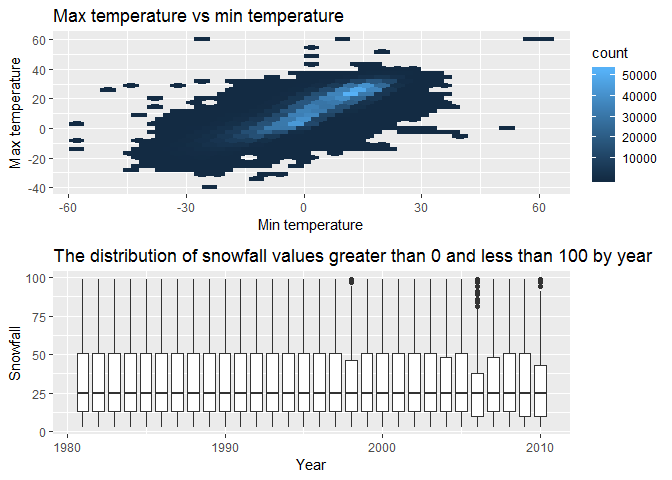

p8105\_hw3\_hx2264
================
Hongyao Xie
October 8, 2018

Problem 1
---------

    ## Skipping install of 'p8105.datasets' from a github remote, the SHA1 (21f5ad1c) has not changed since last install.
    ##   Use `force = TRUE` to force installation

    ## -- Attaching packages --------------------------------- tidyverse 1.2.1 --

    ## v ggplot2 3.0.0     v purrr   0.2.5
    ## v tibble  1.4.2     v dplyr   0.7.6
    ## v tidyr   0.8.1     v stringr 1.3.1
    ## v readr   1.1.1     v forcats 0.3.0

    ## -- Conflicts ------------------------------------ tidyverse_conflicts() --
    ## x dplyr::filter() masks stats::filter()
    ## x dplyr::lag()    masks stats::lag()

    ## 
    ## Attaching package: 'ggridges'

    ## The following object is masked from 'package:ggplot2':
    ## 
    ##     scale_discrete_manual

``` r
# Load the data and use appropriate variable names
data(brfss_smart2010)
brfss <- janitor::clean_names(brfss_smart2010)

# Focus on the "Overall Health" topic
overall_health_index <- which(brfss[,"topic"] == "Overall Health")
brfss <- brfss[overall_health_index,]

# Include only responses from "Excellent" to "Poor"
brfss <- filter(brfss, response == "Excellent" | response == "Very good" | response == "Good" | response == "Fair" | response == "Poor")

# Organize responses as a factor taking levels from “Excellent” to “Poor”
brfss[, "response"] <- as.factor(unlist(brfss[, "response"]))
```

**In 2002, which states were observed at 7 locations?**

``` r
index_2002 <- which(brfss$year == 2002)
brfss_2002 <- brfss[index_2002,]
unique_location <- unique(brfss_2002[,"locationdesc"])
location_by_state <- as.factor(substr(unique_location$locationdesc, 1, 2))
names(which(summary(location_by_state) == 7))
```

    ## [1] "CT" "FL" "NC"

3 states were observed at 7 locations: CT, FL, NC.

**Make a “spaghetti plot” that shows the number of observations in each state from 2002 to 2010.**

``` r
brfss %>%
  group_by(year, locationabbr) %>%
  summarize(uniq = length(unique(locationdesc))) %>%
  ggplot(aes(x = year, y = uniq, color = locationabbr)) + 
    geom_line() +
    labs(
      title = "Spaghetti plot of observations in each state from 2002 to 2010",
      x = "Year",
      y = "Number of observations"
    ) +
  theme(legend.position = "right")
```


**Make a table showing, for the years 2002, 2006, and 2010, the mean and standard deviation of the proportion of “Excellent” responses across locations in NY State.**

``` r
brfss %>%
  filter(., locationabbr == "NY") %>%
  filter(., year == 2002 | year == 2006 | year == 2010) %>%
  filter(., response == "Excellent") %>%
  group_by(year) %>%
  summarize(mean = mean(data_value),
            sd = sd(data_value)) %>%
  knitr::kable(digits = 1)
```

|  year|  mean|   sd|
|-----:|-----:|----:|
|  2002|  24.0|  4.5|
|  2006|  22.5|  4.0|
|  2010|  22.7|  3.6|

**For each year and state, compute the average proportion in each response category (taking the average across locations in a state). Make a five-panel plot that shows, for each response category separately, the distribution of these state-level averages over time.**

``` r
#make a five-panel plot
brfss %>% 
  mutate(., response_ordered = fct_relevel(response, c("Excellent", "Very good", "Good", "Fair", "Poor"))) %>% 
  group_by(year, locationabbr, response_ordered) %>% 
  summarise(mean = mean(data_value)) %>% 
  ggplot() +
  geom_point(aes(x = year, y = mean, color = locationabbr),na.rm = TRUE) + 
  labs(
    title = "Five-panel plot of the distribution of state-level averages over time",
    x = "Year",
    y = "Averages"
  ) +
  facet_grid(~response_ordered)
```


Problem 2
---------

``` r
library(p8105.datasets)
data("instacart")

itc <- instacart %>%
  janitor::clean_names()
colnames(itc)
```

    ##  [1] "order_id"               "product_id"            
    ##  [3] "add_to_cart_order"      "reordered"             
    ##  [5] "user_id"                "eval_set"              
    ##  [7] "order_number"           "order_dow"             
    ##  [9] "order_hour_of_day"      "days_since_prior_order"
    ## [11] "product_name"           "aisle_id"              
    ## [13] "department_id"          "aisle"                 
    ## [15] "department"

The Instacart dataset contains information of online grocery orders from instacart users. There are 1384617 rows and 15 columns in the dataset. The 15 variables are: order\_id, product\_id, add\_to\_cart\_order, reordered, user\_id, eval\_set, order\_number, order\_dow, order\_hour\_of\_day, days\_since\_prior\_order, product\_name, aisle\_id, department\_id, aisle, department. Each row represents an order from a customer, the product is identified by "product\_id" and each customer has the unique "user\_id". When one product has been order by the same customer in the past, the"reordered" column will show 1.

**How many aisles are there, and which aisles are the most items ordered from?**

``` r
nrow(unique(itc[,"aisle"]))
```

    ## [1] 134

``` r
names(which.max(table(itc[,"aisle"])))
```

    ## [1] "fresh vegetables"

There are 134 aisles, out of which `names(which.max(table(itc[,"aisle"])))` is the most items ordered from.

**Make a plot that shows the number of items ordered in each aisle. Order aisles sensibly, and organize your plot so others can read it.**

``` r
itc_aisle <- itc %>% 
  group_by(aisle) %>% 
  summarise(order_num = n())

itc_aisle[order(itc_aisle$order_num, decreasing = TRUE),] %>% 
  ggplot() + 
  geom_point(aes(x = reorder(aisle, -order_num),y = order_num)) +
  labs(
    title = "Scatterplot of the number of items ordered in each aisle",
    x = "Aisle",
    y = "The number of items"
  ) +
  theme(axis.text.x = element_text(angle = 90, hjust = 1,
                                   size = 6))
```


**Make a table showing the most popular item in each of the aisles “baking ingredients”, “dog food care”, and “packaged vegetables fruits”.**

``` r
itc %>% 
  filter(., aisle == "baking ingredients" | 
           aisle == "dog food care" |
           aisle == "packaged vegetables fruits") %>% 
  group_by(aisle) %>% 
  summarize(names(which.max(table(product_name))))
```

    ## # A tibble: 3 x 2
    ##   aisle                      `names(which.max(table(product_name)))`      
    ##   <chr>                      <chr>                                        
    ## 1 baking ingredients         Light Brown Sugar                            
    ## 2 dog food care              Snack Sticks Chicken & Rice Recipe Dog Treats
    ## 3 packaged vegetables fruits Organic Baby Spinach

**Make a table showing the mean hour of the day at which Pink Lady Apples and Coffee Ice Cream are ordered on each day of the week; format this table for human readers (i.e. produce a 2 x 7 table)**

``` r
itc_order <- itc %>% 
  filter(.,product_name == "Pink Lady Apples" |
           product_name == "Coffee Ice Cream") %>%
  group_by(product_name, order_dow) %>% 
  summarize(mean_hour = mean(order_hour_of_day)) %>% 
  spread(., key = order_dow, value = mean_hour) 

colnames(itc_order) <- c("Product", "Sunday", "Monday", "Tuesday", "Wednesday", "Thuresday", "Friday", "Saturday")
itc_order
```

    ## # A tibble: 2 x 8
    ## # Groups:   product_name [2]
    ##   Product        Sunday Monday Tuesday Wednesday Thuresday Friday Saturday
    ##   <chr>           <dbl>  <dbl>   <dbl>     <dbl>     <dbl>  <dbl>    <dbl>
    ## 1 Coffee Ice Cr~   13.8   14.3    15.4      15.3      15.2   12.3     13.8
    ## 2 Pink Lady App~   13.4   11.4    11.7      14.2      11.6   12.8     11.9

Problem 3
---------

    ## [1] "0"

The NOAA dataset provides weather data from stations around the world. There are 2595176 rows and 10 columns in the dataset. The dataset includes variables: id, date, prcp, snow, snwd, tmax, tmin, year, month, day. The missing data exists since stations may not collect certain precipation or snow data.

**Do some data cleaning. Create separate variables for year, month, and day. Ensure observations for temperature, precipitation, and snowfall are given in reasonable units. For snowfall, what are the most commonly observed values? Why?**

The most commonly observed values for snowfall is 0, which implies that most time in NY does not snow.

**Make a two-panel plot showing the average max temperature in January and in July in each station across years. Is there any observable / interpretable structure? Any outliers?**

``` r
noaa %>% 
  filter((month == 1 | month == 7) & !is.na(tmax)) %>% 
  group_by(year, month, id) %>% 
  summarize(tave = mean(tmax)) %>%
  ggplot(aes(x = year, y = tave, group = year)) +
    geom_boxplot() +
    labs(
      title = "The average max temperature in January and in July in each station across years",
      x = "Year",
      y = "Average max temperature"
    ) +
    facet_grid(~month)
```


In each station across years, the average max temperature in July is higher than that in January. The average max temperature in January is around 0 degree, and the average max temperature in July is about 28 degree. The black dots indicate outliers.

**Make a two-panel plot showing (i) tmax vs tmin for the full dataset (note that a scatterplot may not be the best option); and (ii) make a plot showing the distribution of snowfall values greater than 0 and less than 100 separately by year.**

``` r
plot1 <- noaa %>%
  filter(!is.na(tmax) & !is.na(tmin)) %>% 
  ggplot(aes(x = tmin, y = tmax)) +
  geom_hex() +
  labs(
      title = "Max temperature vs min temperature",
      x = "Min temperature",
      y = "Max temperature"
  )
```

``` r
plot2 <- noaa %>%
  filter(snow > 0, snow < 100) %>% 
  ggplot(aes(x = year, y = snow)) +
  geom_boxplot(aes(x = year, year = snow, group = year)) +
  labs(
      title = "The distribution of snowfall values greater than 0 and less than 100 by year",
      x = "Year",
      y = "Snowfall"
  )
```

    ## Warning: Ignoring unknown aesthetics: year

``` r
plot1/plot2
```


